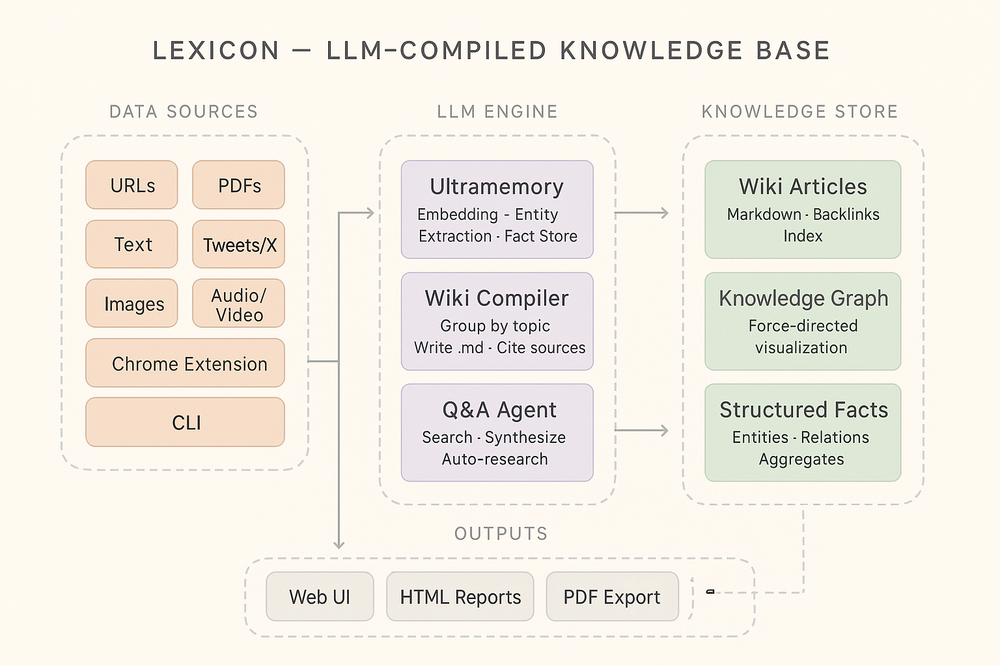
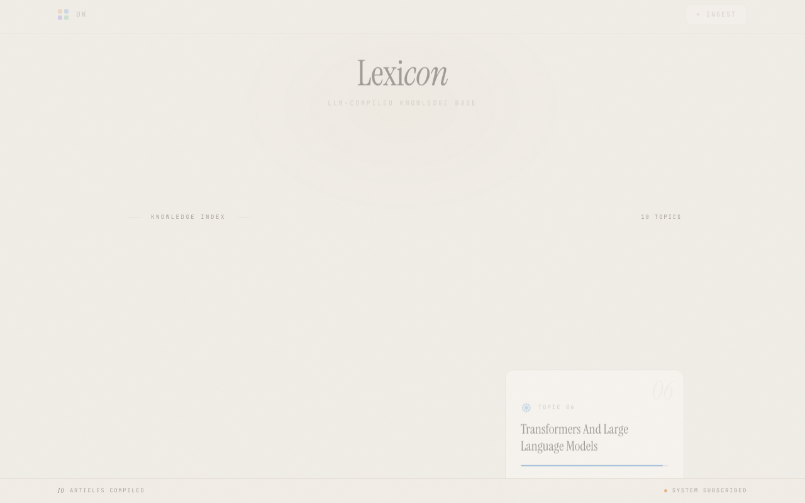
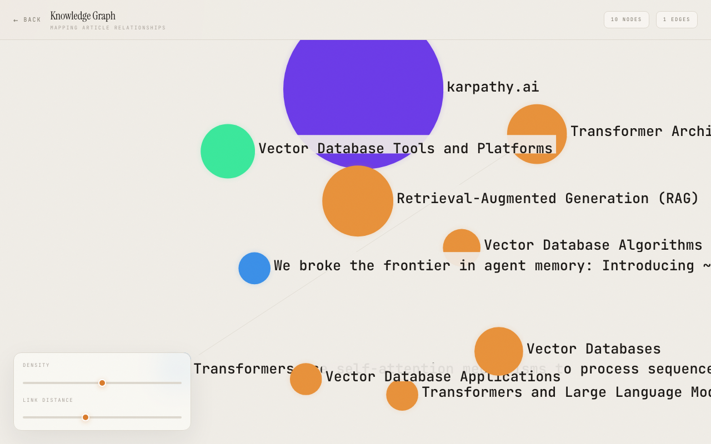
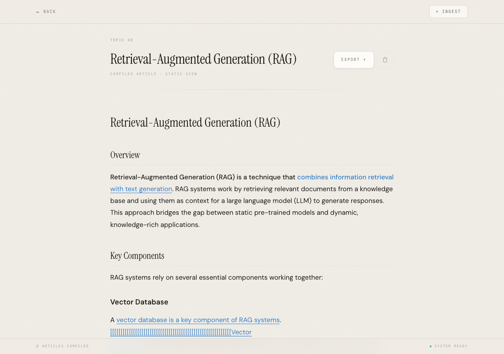

<p align="center">
  
</p>

<h1 align="center">Lexicon</h1>
<p align="center"><strong>An LLM-compiled personal knowledge base.</strong></p>
<p align="center">
  You feed it information. An LLM compiles it into a wiki.<br>
  You don't write the articles — the LLM does.
</p>

<p align="center">
  <a href="#quickstart">Quickstart</a> ·
  <a href="#features">Features</a> ·
  <a href="#how-it-works">How It Works</a> ·
  <a href="#web-ui">Web UI</a> ·
  <a href="#api-reference">API</a> ·
  <a href="#contributing">Contributing</a>
</p>

---

## The Idea

Most knowledge tools make _you_ do the organizing. You tag, you file, you link.

Lexicon flips this: you throw information at it — URLs, PDFs, tweets, search results, images, notes — and an LLM compiles everything into a browseable wiki of interconnected markdown articles with backlinks, citations, and source tracking.

**The wiki is the output, not the input.**

Inspired by [Andrej Karpathy's vision](https://x.com/karpathy) of LLMs as knowledge compilers — the idea that AI should actively organize and maintain your knowledge, not just retrieve it.

---

## Web UI

<p align="center">
  
  <br><em>Dashboard — browse compiled articles, search, and ask questions</em>
</p>

<p align="center">
  
  <br><em>Knowledge Graph — interactive force-directed visualization of article relationships</em>
</p>

<p align="center">
  
  <br><em>Article View — compiled wiki article with citations, wikilinks, and export options</em>
</p>

---

## Quickstart

### Install

```bash
pip install lexiconai
```

### Configure

```bash
# Required: an LLM provider
export OPENAI_API_KEY="sk-..."       # or GEMINI_API_KEY, ANTHROPIC_API_KEY

# Optional: web research via Exa
export EXA_API_KEY="your-key"

# Optional: use a specific model (default: gemini/gemini-2.0-flash)
export LEXICON_LLM_MODEL="openai/gpt-4o-mini"
```

### Go

```bash
# Ingest a URL
uk ingest https://arxiv.org/abs/2401.12345

# Research a topic (searches web, ingests, compiles)
uk research "transformer architecture advances 2025"

# Ask a question with citations
uk ask "What are the key differences between attention mechanisms?"

# Start the web UI
uk serve    # → http://localhost:8899
```

---

## Features

| | Feature | Description |
|---|---------|-------------|
| 📥 | **Multi-source ingest** | URLs, PDFs, text files, folders, tweets/X posts, images, audio, video |
| 🧠 | **LLM wiki compiler** | Groups chunks by topic, writes/updates markdown articles, cites sources |
| 🔗 | **Auto-linking** | Entity mentions become `[[wikilinks]]`, index rebuilt automatically |
| 🔍 | **Semantic search + Q&A** | Ask questions, get answers grounded in your KB with citations |
| 🌐 | **Web research** | Search via [Exa](https://exa.ai), ingest results, compile — all in one command |
| 👁️ | **Watch mode** | Recurring research keeps topics fresh (`uk watch "topic" --interval 60`) |
| 🔬 | **Knowledge linting** | Detects contradictions, staleness, and coverage gaps |
| 📊 | **Knowledge graph** | Interactive force-directed visualization of article relationships |
| 📤 | **Export** | HTML reports, PDF, article snapshots, full-KB export |
| 🧩 | **Chrome extension** | Clip any page or tweet directly into your KB |
| 🖼️ | **Multimodal** | Ingest images, audio, and video via Gemini multimodal embeddings |
| 🏠 | **Local-first** | SQLite + optional local LLMs via Ollama. Your data stays yours |
| 🔌 | **Provider flexible** | Gemini, Claude, GPT, Ollama, or any LiteLLM-supported model |

---

## How It Works

### Pipeline

1. **Ingest** — Content is chunked, embedded (sentence-transformers or Gemini), and stored in SQLite with extracted entities and facts
2. **Compile** — LLM groups related chunks by topic, writes/updates markdown articles, preserves manual edits
3. **Link** — Auto-linker scans for entity overlap, generates `[[wikilinks]]` and rebuilds the index
4. **Serve** — Web UI, API, and CLI provide search, Q&A, graph visualization, and export

---

## CLI Reference

```bash
uk ingest <source>        # Ingest a URL, file, folder, or text
uk research <query>       # Search Exa → ingest → compile → link
uk ask <question>         # Q&A with citations and auto-research fallback
uk compile                # Compile wiki from ingested chunks
uk lint                   # Report staleness, contradictions, and gaps
uk export <topic>         # Export as HTML report or PDF
uk watch <topic>          # Recurring research + compile + lint
uk serve                  # Start web UI + API server
```

---

## API Reference

All endpoints are under `/api/`:

| Endpoint | Method | Description |
|----------|--------|-------------|
| `/api/topics` | GET | List all compiled articles |
| `/api/ingest` | POST | Ingest URL or text |
| `/api/ingest-media` | POST | Ingest image, audio, or video |
| `/api/search` | POST | Semantic search |
| `/api/ask` | POST | Q&A with citations |
| `/api/research` | POST | Web research via Exa |
| `/api/articles/{slug}` | GET | Read an article |
| `/api/articles/{slug}` | DELETE | Delete an article |
| `/api/compile` | POST | Trigger compilation |
| `/api/lint` | POST | Run quality checks |
| `/api/export` | POST | Export an article |
| `/api/export-all` | POST | Export full KB as single HTML |
| `/api/graph` | GET | Knowledge graph data (nodes + edges) |
| `/api/stats` | GET | Memory stats |

Interactive API docs at `http://localhost:8899/docs`.

---

## Configuration

| Variable | Default | Description |
|----------|---------|-------------|
| `LEXICON_LLM_MODEL` | `gemini/gemini-2.0-flash` | LiteLLM model string |
| `LEXICON_HOST` | `127.0.0.1` | Server bind address |
| `LEXICON_PORT` | `8899` | Server port |
| `LEXICON_API_TOKEN` | — | Bearer token for write endpoints (optional) |
| `LEXICON_KB_DIR` | `./kb` | Wiki output directory |
| `LEXICON_LOG_LEVEL` | `INFO` | Logging level |
| `EXA_API_KEY` | — | Exa API key for web research |

---

## Using Local Models

Lexicon works great with local models via [Ollama](https://ollama.ai):

```bash
pip install lexiconai[local]
export LEXICON_LLM_MODEL="ollama/llama3"
uk serve
```

---

## Chrome Extension

The included Chrome extension lets you clip any page or tweet into your KB with one click.

1. Open `chrome://extensions` → Enable Developer Mode
2. Click "Load unpacked" → Select the `extension/` folder
3. (Optional) Set your server URL and API token in the extension options

---

## Manual Edits

Articles support manual sections that survive recompilation:

```markdown
## LLM-Generated Section

This content will be updated by the compiler.

<!-- manual -->
## My Notes

This section is preserved across recompilations.
<!-- manual -->
```

---

## Architecture

| Component | Purpose |
|-----------|---------|
| **Ultramemory** | Semantic memory backend — embedding, entity/fact extraction, vector search |
| **Wiki Compiler** | LLM groups chunks by topic, writes/updates markdown articles |
| **Auto-Linker** | Scans articles for entity overlap, generates `[[backlinks]]` and `Index.md` |
| **Connectors** | URL fetch, tweet extraction (fxtwitter/oembed), file/folder ingest |
| **Exa Integration** | Web search, content fetching, research pipeline |
| **Q&A Agent** | Searches KB → LLM synthesizes answer → auto-research on low confidence |
| **Linter** | Checks for contradictions, staleness, entity coverage gaps |
| **Exporter** | HTML reports, PDF (weasyprint/pdfkit), article snapshots, full-KB export |
| **Knowledge Graph** | Force-directed visualization with interactive node exploration |
| **Server** | FastAPI with SSRF protection, timing-safe auth, graceful shutdown |

---

## Security

- **Auth** — Optional bearer token on all write endpoints (`LEXICON_API_TOKEN`)
- **SSRF protection** — URL ingest rejects private/loopback/link-local addresses
- **Path traversal protection** — Slug validation on all file-serving endpoints
- **XSS mitigation** — DOMPurify on rendered markdown, programmatic event binding
- **Local by default** — Binds to `127.0.0.1`, not `0.0.0.0`

---

## Development

```bash
git clone https://github.com/jared-goering/lexiconai
cd lexiconai
pip install -e ".[dev]"
pytest
```

See [CONTRIBUTING.md](CONTRIBUTING.md) for guidelines.

---

## License

MIT © 2026 Jared Goering
